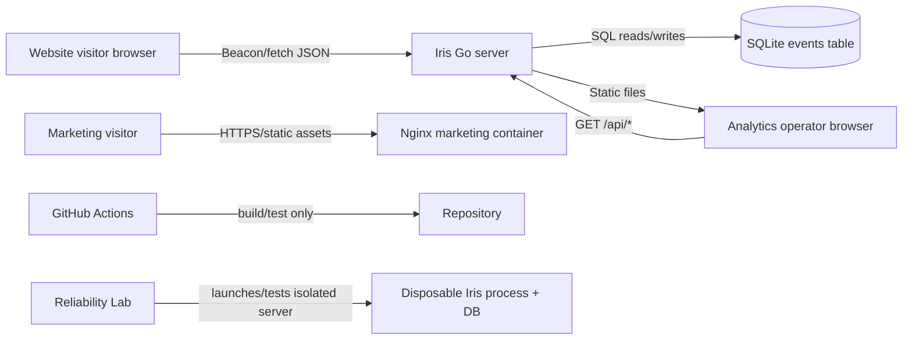
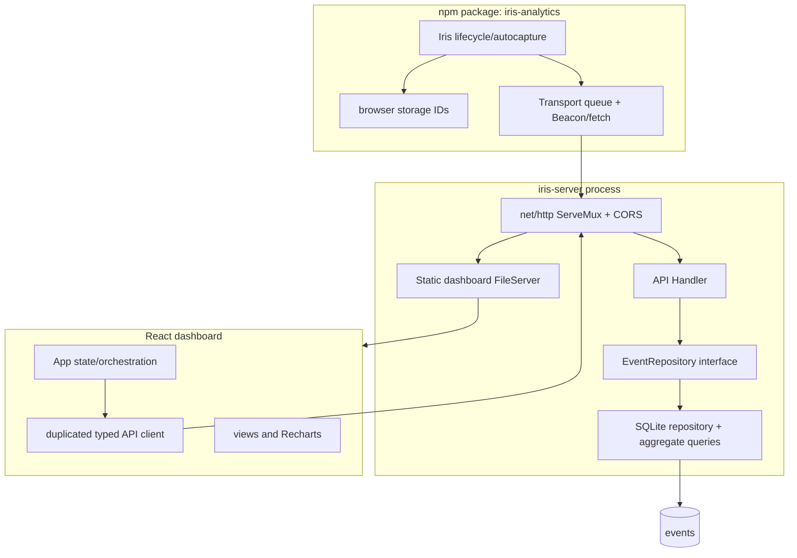

# 01 — System, Repository, and Startup

> **Essential · Architecture map**

## Product and users

**Confirmed.** Iris is a privacy-oriented, self-hosted web analytics product for developers who want traffic, custom-event, and real-user performance reporting without operating a larger analytics platform. The clearest product statement is `docs/ROADMAP.md:3-27`; the implementation supports pageviews, sources, devices, custom events, and LCP/INP/CLS.

There are two practical human roles, but neither exists as an authenticated domain entity:

- a **site developer** embeds/configures the SDK;
- an **analytics operator** opens the dashboard and operates the deployment.

The application has no accounts, teams, roles, billing, site creation workflow, or admin panel. “Users” and “sites” are therefore product concepts, not database records.

## System context

Text explanation: website visitors cross an origin/network boundary to the ingestion API. Operators normally fetch the dashboard and analytics API from the same Go origin. The Go process is the only production process that opens SQLite. Marketing has a separate Nginx deployment and no data connection. CI does not deploy. The lab is an engineering-only boundary that operates disposable server/database instances.

### Trust and ownership boundaries

| Boundary | Data/authority crossing | Current enforcement |
|---|---|---|
| Visitor browser → ingestion API | URLs, referrer, viewport, pseudonymous IDs, arbitrary properties and site ID | Body size and batch-count limits only; no identity, origin allowlist, or field validation |
| Operator browser → query API | All data selected by caller-provided `site_id` | No authentication or authorization |
| Go → SQLite | All durable product data | File-system permissions and SQLite primary key only |
| Internet → marketing | Public static content | Nginx; no app backend |
| GitHub runner → source | build/test permission | Workflow declares `contents: read` |

### Process, network, failure, and deployment boundaries

- **Process:** production analytics is one Go OS process. Dashboard JavaScript runs in each operator browser. SQLite is an in-process C library through CGO, not a network service.
- **Network:** the Go listener binds all interfaces through `http.ListenAndServe(":"+port, ...)`. TLS/DNS/reverse proxy are outside the repo.
- **Data:** the mounted SQLite file is the sole durable product state. Browser storage holds only IDs; dashboard state is memory-only.
- **Failure:** server crash stops ingestion, queries, and dashboard static serving together. Marketing can remain available. Loss of the volume loses analytics.
- **Deployment:** root `Dockerfile` produces backend+dashboard; `marketing/Dockerfile` produces marketing. The SDK is an npm artifact rather than a running service.
- **Synchronous/asynchronous:** query and insertion work is synchronous in the Go handler. Beacon/fetch is asynchronous from the page’s perspective. No server-side asynchronous work exists.

## Container/component view

`core.EventRepository` is the only dependency-inversion seam. There is no separate service/use-case layer: handlers call repository aggregations directly. “Core” contains transport/data shapes and the repository interface, not rich domain behavior (`pkg/core/event.go`).

## Guided repository map

### Root files

- `README.md` — public quickstart, architecture headline, SDK examples, three backend variables, and selected reporting semantics. Depends on implementation staying aligned. **Risk:** its privacy and production framing is stronger than current enforcement.
- `Taskfile.yml` — developer command façade for build/dev/publish and the Reliability Lab. It invokes Go, pnpm, Docker, and compiled binaries. **Operationally important.**
- `Dockerfile` — production analytics build: Node dashboard stage, CGO Go stage, Alpine runtime. **Risk:** changing paths, CGO packages, or volume variables can produce a healthy-looking image with no persistence/UI.
- `docker-compose.yml` — one analytics service, host port `8081`, and a bind mount at `../files/iris-data`. **Contradiction:** README says `./data/iris.db`; compose intentionally changed to a sibling path in commit `a78a5ee`.
- `package.json`, `pnpm-workspace.yaml`, `pnpm-lock.yaml` — JS workspace and shared testing/build tools. Root `npm test` is deliberately a failing placeholder; use named scripts.
- `go.mod`, `go.sum` — Go 1.22 contract and two direct dependencies.
- `.github/workflows/ci.yml` — only CI automation. There is no repository deployment workflow.
- `.env` — local ignored configuration. It contains the three active runtime variables plus two obsolete CORS allowlist names. Values are intentionally not documented.
- `.gitignore`, `.dockerignore` — exclude secrets, DBs, build output, reliability artifacts, and monorepo components from analytics image context.
- `iris_architecture.md` — 2026-02-21 summary. It predates batching, daily visitor rotation, reliability lab, current dashboard, and new APIs. It also contains stale absolute `file://` links.
- `AGENTS.md` — AI contribution conventions, not runtime behavior.

### `cmd/`

- `cmd/server/main.go` — the only production entry point. Reads configuration, creates DB, registers all routes, optionally exposes pprof, serves dashboard files, and blocks in `ListenAndServe`.
- `cmd/iris-lab/main.go` — engineering CLI entry with `run`, `suite`, `faults`, and `compare` subcommands. It is not shipped by the root production image.
- `cmd/server/data/iris.db` — ignored local state (12 rows at inspection), not tracked. Its location is caused by `task dev:backend` running with `cmd/server` as working directory.

### `pkg/`

- `pkg/core/event.go` — all event/response DTOs and `EventRepository`. Framework independent, but not a behavioral domain model.
- `pkg/api/handler.go` — all HTTP parsing, server-owned fields, simple validation, trend calculation, error mapping, and repository invocation. **Risky:** all public contracts converge here.
- `pkg/api/cors.go` — origin reflection/wildcard behavior applied separately to every API route. **Security critical.**
- `pkg/db/sqlite.go` — schema bootstrap, inserts, transaction for batch, lab-only page-growth controls. **Risky:** schema changes occur implicitly on startup with no versioning.
- `pkg/db/query.go` — every analytics definition, including time filters, site fallback, referrer normalization, P75, Core Web Vitals scoring, and sorting. **Highest business-semantics risk.**
- `pkg/api/*_test.go`, `pkg/db/query_test.go` — aggregation, date, trend, and CORS tests. Handler ingestion itself is not directly tested.

### `web/`

- `web/src/index.ts` — public `Iris` class, lifecycle, event payload creation, and `pushState`/`popstate` capture.
- `storage.ts` — local/session/memory ID behavior.
- `transport.ts` — immediate/batch queue, Beacon/fetch, interval and page-leave lifecycle.
- `autocapture.ts` — delegated click capture, including element text/class/href collection.
- `vitals.ts` — web-vitals adapter.
- `config.ts`, `constants.ts` — public types and wire names.
- `web/package.json` — npm metadata/version 0.2.3 and `tsup` build.
- `web/dist` — ignored generated package build; rebuilt during verification.

### `dashboard/`

- `src/main.tsx` — React 18 client bootstrap.
- `src/App.tsx` — view/date/site state and overview orchestration. It launches 11 parallel requests on site/date changes and N site-trend requests in Sites view.
- `src/api.ts` — handwritten duplicate of Go response types plus fetch functions.
- `src/components` — presentational views; `EventsPage` also performs its own data fetching.
- `src/index.css` — large global class-based styling system; there is no CSS module/design-token package.
- `vite.config.ts` — React plugin, `/api` development proxy, `dist`.
- `vite.config.js`, `vite.config.d.ts`, `*.tsbuildinfo` — **tracked generated artifacts**. They can drift from TypeScript source and should not be architecture authorities.
- `dist`, `node_modules` — ignored generated/local artifacts.
- `StatsCards.tsx` and `WebVitals.tsx` — appear unused by current imports; likely remnants of earlier dashboard designs.

### `marketing/`

- `src/main.tsx` — React 19 BrowserRouter with `/` and `/docs`.
- `App.tsx` — static product site with illustrative data and claims.
- `Docs.tsx` — public SDK/API/deployment documentation.
- `Dockerfile` — npm build followed by Nginx static runtime.
- `README.md` — untouched Vite template, not project documentation.
- `package-lock.json` plus root `pnpm-lock.yaml` — two lock mechanisms. Docker uses npm lock; workspace/CI uses pnpm lock.
- BrowserRouter has no Nginx SPA fallback configuration; direct `/docs` requests may return 404 depending on Nginx defaults. **Strong inference** from the stock Nginx image and absent config.

### `internal/reliability/` and `testing/load/`

- `internal/reliability` — deterministic manifest, load generation, concurrent read load, raw SQLite/public API reconciliation, reporting, resource sampling, pprof capture, suite process management, fault injection, backup/restore verification, and comparisons.
- `testing/load/browser/run.mjs` — real-browser harness with 35 scenarios, generated state-machine traces, failure responses, lifecycle and React Router fixtures.
- `testing/load/browser/compare.mjs` — baseline-aware regression logic; known failures may remain without failing CI.
- `testing/load/k6` — independent arrival-rate ingestion/read/browser probes.
- `testing/load/baselines/2026-07-29` — committed reference summaries/reports. Server DB/log/resource raw artifacts are ignored. Baselines are machine/revision-specific evidence, not promises.

### Dead-looking, generated, experimental, and unclear

| Classification | Items | Assessment |
|---|---|---|
| Likely unused | `dashboard/src/components/StatsCards.tsx`, `WebVitals.tsx` | No current import found; historical UI remnants |
| Generated but tracked | dashboard `vite.config.js`, `.d.ts`, `*.tsbuildinfo`; root and marketing npm locks | Can create drift/noise |
| Generated and ignored | `dist/`, all `node_modules/`, local `.db` files | Safe to regenerate; DBs may contain real local analytics |
| Lab-only production hooks | `IRIS_LAB_PPROF`, `IRIS_LAB_DB_EXTRA_PAGES`, pprof route, growth PRAGMAs | Intentional testability, dangerous if enabled publicly |
| Experimental/operational | Reliability Lab and committed baselines | High-value engineering system, not application runtime |
| Unclear/stale | root package’s `biome`, `turbo`, Changesets; `marketing/README.md`; `.env` CORS variables | Dependencies/config values have no current invocation |

## Startup and entry points

### Production analytics startup

1. Container starts `./iris-server` (`Dockerfile:46`).
2. `main()` reads `PORT` and `DB_PATH` with defaults (`cmd/server/main.go:15-18`).
3. It always creates a relative directory named `data`, **not the parent of `DB_PATH`** (`:19-21`). A custom path whose parent does not exist can still fail later.
4. `NewSqliteDB` calls `sql.Open` and executes `CREATE TABLE/INDEX IF NOT EXISTS` (`pkg/db/sqlite.go:45-74`). `sql.Open` is lazy, but schema execution forces access.
5. Optional lab page-count PRAGMAs are applied only when `IRIS_LAB_PPROF=1`.
6. A concrete repository is injected behind `core.EventRepository` into `api.Handler`.
7. A fresh `http.ServeMux` registers 17 API paths, optional pprof, and `/` static files (`cmd/server/main.go:44-73`).
8. `http.ListenAndServe` starts a default server without read/write/idle/header timeouts (`:75-77`).
9. Initialization errors call `log.Fatal`, exiting non-zero. There is no retry/readiness state.
10. Normal cleanup is only deferred `db.Close`; `log.Fatal`/process signals do not execute deferred functions. There is no signal handler, `Server.Shutdown`, request draining, or explicit transaction shutdown.

### Development startup

- `task dev` declares backend and dashboard tasks as dependencies; Task runs them concurrently.
- Backend: `task dev:backend` changes cwd to `cmd/server` and runs `go run main.go`, so default DB/dashboard paths resolve under `cmd/server`.
- Dashboard: Vite on its default port (documented as 5173) proxies `/api` to `localhost:8080`.
- Marketing: independent Vite server through `task dev:marketing`.
- SDK: no watch script exists; build with pnpm and consume/link separately.

### Frontend entry points

- Dashboard: `dashboard/index.html` → `src/main.tsx` → `<App/>`.
- Marketing: `marketing/index.html` → `src/main.tsx` → BrowserRouter → `App` layout → `Home` or `Docs`.
- SDK: package exports compiled `web/src/index.ts`; there is no auto-running global script. Consumer code constructs `Iris` and must call `start()`.

### Test and CLI entry points

- Go test discovery: `go test ./...` (CI adds `-race`) across API, DB, and reliability packages.
- JS comparator: `pnpm test:browser-oracle`.
- Real browser: `pnpm lab:browser`; full known baseline is currently failing by design.
- Lab CLI: `go run ./cmd/iris-lab` or `dist/iris-lab`; suite starts isolated server processes on loopback random ports.
- k6: Docker-based `task lab:k6`.

### No entry points found

There is no production worker, background-job process, scheduler/cron, migration command, seeder, webhook consumer, application CLI, SSR server, queue consumer, or cache process.

## Dependency rationale

### Production runtime

| Dependency | Where/why | Failure/lock-in/upgrade notes |
|---|---|---|
| Go standard `net/http`, `database/sql` | Server/routing/concurrency/DB abstraction | Essential; low lock-in. Default server settings are currently underconfigured. |
| `mattn/go-sqlite3` | SQLite driver (`pkg/db/sqlite.go`) | Essential; CGO toolchain and platform-specific build dependency. SQLite semantics are architectural lock-in until repository/query changes. |
| `google/uuid` | Server IDs for each accepted event | Replaceable; no client idempotency because the server always generates a new ID. |
| React/ReactDOM 18 | Dashboard client rendering | Replaceable but broad UI rewrite; no SSR. |
| Recharts | Overview/custom-event charts | Source of much of the 586 kB dashboard bundle; replaceable. |
| date-fns | date windows/labels | Replaceable; timezone formatting participates in query semantics. |
| `web-vitals` | Browser LCP/INP/CLS capture | Essential only for performance reporting; client API/version changes require wire verification. |
| React/ReactDOM 19, React Router, Framer Motion, Lucide | Marketing routing, animation, icons | Nonessential to analytics runtime; static-site lock-in is modest. |
| Nginx | Marketing static runtime | Replaceable; absent SPA fallback is an operational concern. |

No application runtime calls a third-party SaaS/API. Data leaves the tracked site only for the operator’s configured Iris host. Costs are compute/storage/bandwidth and deployment-provider costs, all unknown from the repo.

### Build/development/infrastructure

- Vite and TypeScript build both React apps; tsup bundles the SDK.
- pnpm is the monorepo manager; npm is separately used by the marketing Docker image and `npm publish`.
- Task is a convenience dependency, not required if commands are run directly.
- Playwright/Chromium and k6 exercise browsers/load.
- GitHub Actions v6 actions run CI; tags are major-version mutable rather than commit-SHA pinned.
- `turbo`, `biome`, Changesets, and root `esbuild` appear unused by scripts. **Confirmed by repository search;** indirect future/manual use is unknown.
