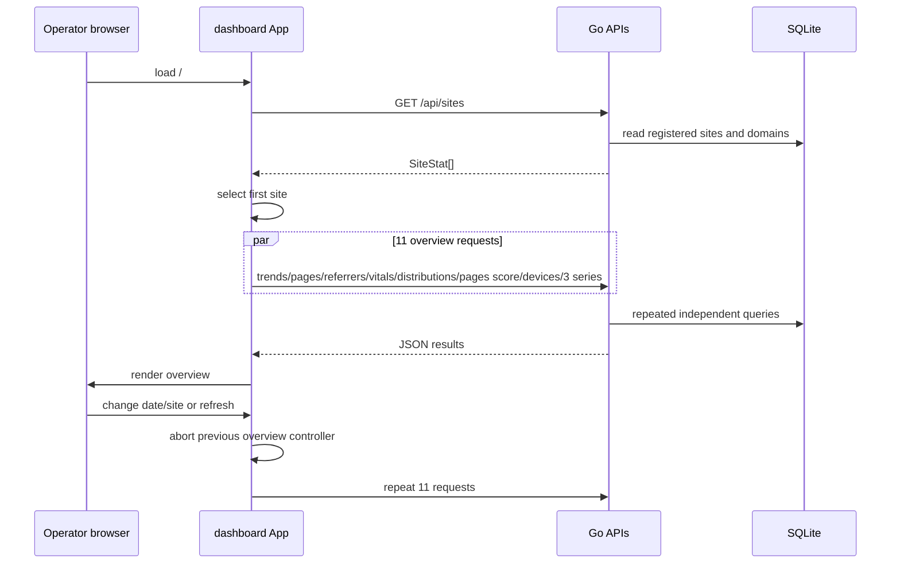

# 02 — Runtime Journeys and Frontend Architecture

> **Essential · Trace the product**

## Journey 1: initial automatic pageview

```mermaid
sequenceDiagram
    participant Site as Host application
    participant SDK as Iris SDK
    participant Store as Browser storage
    participant API as Go /api/event
    participant DB as SQLite events
    participant UI as Dashboard

    Site->>SDK: new Iris(config); start()
    SDK->>Store: get/create session ID and today's visitor ID
    SDK->>SDK: build $pageview from location/referrer/width/siteId
    SDK-->>API: sendBeacon JSON (or fetch if Beacon API absent)
    API->>API: validate site/domain/version; sanitize URL; truncate props
    API->>DB: INSERT event
    DB-->>API: success
    API-->>SDK: 202 Accepted (not observed by Beacon code)
    UI->>API: GET aggregate endpoints later
    API->>DB: SELECT/aggregate
    API-->>UI: JSON
```

Text trace:

1. Consumer code constructs `Iris`. The constructor merges defaults (`autocapture: false`, `debug: false`) and constructs `Transport`; a batching timer can therefore start **before** `Iris.start()` (`web/src/index.ts:17-24`; `transport.ts:15-27`).
2. `start()` is per-instance idempotent. Automatic pageviews occur only when `autocapture.pageviews === true`; despite public examples, autocapture is off by default (`index.ts:26-42`).
3. `track("$pageview")` reads the full `window.location.href`, hostname, `document.referrer`, viewport width, configured site ID, session ID, and visitor ID (`index.ts:44-56`).
4. Visitor ID is `localStorage`-stable for one UTC date. Session ID is shared
   across same-origin tabs through `localStorage` and rolls after 30 minutes of
   tracked inactivity or at the UTC visitor boundary. Storage errors use
   page-memory IDs (`storage.ts`).
5. Without batching, transport calls Beacon whenever the API exists. It does not inspect Beacon’s Boolean result and uses fetch only when Beacon is absent (`transport.ts:81-99`).
6. CORS reflects any supplied origin and permits credentials (`pkg/api/cors.go`).
7. `TrackEvent` limits the body to 1 MiB, validates required identifiers,
   reserved names, width, schema version, timestamp skew, registered site, and
   allowed hostname. It removes URL/referrer query strings and fragments and
   truncates property strings before inserting synchronously.
8. SQLite stores JSON properties as validated text, client occurrence and server
   receive times as UTC integer microseconds, and normalized URL dimensions.
9. A successful write returns empty `202 Accepted`. Errors are plain text 400/500 and logged.

Failure/edge paths:

- Deeply nested properties are not depth-limited, and browser identifiers remain
  caller assertions. Invalid required fields, URLs, widths, reserved names,
  sites, domains, clock skew, and schema versions are rejected.
- JSON trailing values are not explicitly rejected; only the first decoded value is used.
- Beacon refusal, offline state, 429/5xx, and connection loss have no SDK retry/fallback. The baseline confirms losses (`rejected-beacon...`, `transient-server-failure...`, `offline...`).
- A response lost after insert can be replayed safely when it retains the same
  client event ID; the unique ID conflict does not insert a second row.
- Server logs the normalized URL after query strings and fragments are removed.
- No application metric or trace records the flow.

Relevant verification: `testing/load/browser/run.mjs → initial-pageview`, `storage-unavailable...`, delivery-chaos scenarios; `internal/reliability → VerifyStorage/VerifyAggregates`.

## Journey 2: SPA navigation

1. First automatic pageview calls `enableHistoryPatch`.
2. A module-global `pushStatePatched` allows only one instance to patch `history.pushState`.
3. The patch calls the original method, then sends a pageview; `popstate` also sends one (`web/src/index.ts:63-77`).
4. `replaceState` is patched and persisted BFCache `pageshow` events emit a
   pageview. There is no explicit `hashchange` handler.
5. `stop()` flushes/destroys transport, removes click/popstate listeners, restores `pushState`, and clears the global guard only for the instance that owns the saved original.

Historical edge results from the committed 2026-07-29 baseline (captured before
the current navigation fixes and retained as regression evidence):

- same-URL `pushState` double-counts;
- `replaceState` is missed;
- multiple started instances can produce duplicate initial events;
- React Router data navigation/redirect misses an event;
- BFCache return is missed;
- generated state traces diverged in 12/16 traces.

These are **confirmed defects**, not merely possible risks (`testing/load/baselines/2026-07-29/browser/browser-report.md`).

## Journey 3: click autocapture and manual custom event

### Autocaptured click

The capture-phase listener finds the nearest button, anchor, submit input, or `[role=button]`; skips `.iris-ignore` and password input elements; then emits `$click` with tag, ID, full `className`, up to 50 characters of visible text, and anchor href (`web/src/autocapture.ts`).

Security/privacy implications:

- **Confirmed:** arbitrary text/class/href data can be captured and later logged/stored; only property string truncation applies.
- **Confirmed:** password inputs are skipped, but buttons/links surrounding sensitive data are not.
- **Confirmed:** the event target is cast to `HTMLElement`; unusual non-Element targets could make `closest` unsafe, though typical click targets are Nodes/Elements.

### Manual event

`iris.track("checkout_completed", {plan: "pro"})` uses the same payload/delivery path. Query logic defines “custom” as a non-empty event name not beginning with `$` (`pkg/db/query.go:387-457`). There is no event schema registry or per-event property contract.

The custom-event conversion rate is:

`distinct sessions among any custom events / distinct sessions among $pageview events × 100`

This is not a selected-event conversion rate. A custom event in a session without a pageview can make the numerator exceed the denominator; values above 100% are possible because there is no intersection join (`GetCustomEvents`).

## Journey 4: batched delivery

1. Enabling `batching` starts an interval and optionally page visibility/pagehide listeners.
2. `send()` appends to an in-memory array and flushes at `maxSize`.
3. `flush()` removes **the entire queue before delivery**, serializes it, and calls Beacon or fetch (`web/src/transport.ts:41-63`).
4. Client batching values are not validated. `maxSize > 50` conflicts with the backend hard limit; nonpositive intervals/sizes have browser-dependent/unhelpful behavior.
5. Server rejects over 50 events with 413; an empty array returns 202; otherwise it gives every row the same ingestion timestamp and inserts all rows in one transaction (`handler.go:76-116`; `sqlite.go:109-149`).
6. Any row failure rolls back the whole batch. The client still has already discarded the queue.

The transaction is a good atomicity boundary: no partial batch is committed.
Client-generated IDs make replay idempotent, although the browser queue is still
volatile and delivery is not guaranteed.

## Journey 5: open/select/refresh dashboard



Important details:

- Sites come from the `sites` and `site_domains` registry, so a newly registered
  site can be selected before its first event. The dashboard lists sites but
  registration currently happens through `POST /api/sites` rather than a form.
- The first returned site is auto-selected.
- Date presets use the operator browser clock/timezone. `24h` sends an offset
  timestamp; day presets format local calendar dates. Event buckets and visitor
  rotation use the configured site timezone, which must match in SDK and server.
- An `AbortController` cancels the previous overview request group on rapid changes, but the effect has no explicit unmount cleanup. EventsPage has separate controllers/cleanup.
- `Promise.all` is all-or-nothing: one failed overview endpoint prevents every state update, leaving prior data visible and only logging to the browser console.
- The dashboard fetches all overview data regardless of active needs. `GetPerformanceScore` internally repeats vital/distribution queries, increasing DB work.
- Selecting Sites view makes one trend request per site (N requests). This is a client-side N+1 pattern.
- Navigation is React state, not URL routing. Refresh/deep link always returns to overview/default state.
- There is no polling/live view. Refresh reconstructs the date window and refetches.

## Journey 6: custom-event and Web Vitals dashboards

Events view fetches the aggregate result, selects the first event, and then fetches that event’s daily series. Search is local filtering. Selecting a row changes the series request. Copy implementation uses the Clipboard API without user feedback or error handling.

**Contradictory evidence:** the generated snippet in `dashboard/src/components/EventsPage.tsx:86-97` instructs users to install `@iris-analytics/sdk`, default-import `Iris`, and use an `endpoint` option. The actual package is `iris-analytics`, exports named `Iris`, and requires `host`. This workflow is currently broken documentation.

Vitals view uses aggregate P75, distributions, score, and per-page data already fetched by App. Thresholds are duplicated in Go and UI. Its Filter button has no handler. Sites cards’ options/add-site controls and aggregate health are also illustrative/nonfunctional; SparkBars and aggregate health are synthetic.

## Frontend architecture

### Dashboard

- **Framework/rendering:** React 18 single-page client, Vite build, no SSR/server components.
- **Routing:** view state enum only (`dashboard|sites|events|vitals`); browser URL does not represent view/site/date.
- **State:** local React state in `App`; EventsPage owns its query/result/selection/series state. No context/store.
- **Data fetching/cache:** native fetch through `api.ts`; no caching, deduplication, revalidation, retry, timeout, schema validation, or persistence.
- **Forms/validation:** search and select controls only; no server mutations. Validation is substring filtering.
- **Authentication/authorization:** the UI has none. The API requires an admin
  bearer token only for site mutation; site listing, analytics reads, and event
  ingestion remain unauthenticated.
- **Loading/errors:** loading spinners/empty states exist; errors only reach console and old state may remain. No React Error Boundary.
- **Components:** mostly presentational components receive typed props. `App` is a growing orchestrator and `EventsPage` mixes presentation/fetching.
- **Styling:** one global CSS file with CSS variables/classes and inline styles. No formal shared design-system package.
- **API contract:** handwritten TS interfaces duplicate Go JSON DTOs; no OpenAPI/code generation/runtime decoding.
- **Environment:** no `import.meta.env`; same-origin `BASE=""`. Development uses proxy.
- **Assets:** Vite hashes JS/CSS. Dashboard `index.html` includes remote Google font stylesheet references, so those fonts disclose dashboard load to Google and fail offline.
- **Accessibility:** labels/ARIA exist in places; semantic buttons/tables are used. Risks include color-only trends, icon controls without implementation, graph accessibility, dynamic loading announcements, and small text. No automated accessibility tests.
- **Performance:** production build measured 585.85 kB JS/168.24 kB gzip and emitted Vite’s >500 kB warning. Recharts and eager loading dominate likely cost; no route/code splitting.
- **Browser storage/analytics:** dashboard uses neither. It does not embed its own Iris SDK.

Business logic leaked/duplicated in UI:

- date window construction and timezone behavior (`App.tsx`);
- Core Web Vitals thresholds/ratings/formatting (`VitalsPage.tsx`, unused `WebVitals.tsx`, and Go);
- “tracked pages” is `pages.length`, but API limits pages to top 10, so label is misleading;
- Sites “Recording” status is unconditional;
- illustrative health/spark data can be mistaken for live analytics.

### Browser SDK

- The SDK is imperative and browser-global; importing/constructing it during SSR would access `document` in `Transport` only when batching is enabled, while `start/track` require browser globals.
- Module-global history patching makes multiple versions/instances share fragile global state.
- `initVitals` returns no cleanup, so `stop()` cannot unregister web-vitals observers/callbacks.
- Transport lifecycle is coupled to construction: after `stop()` destroys the timer/listeners, a later `start()` does not create a new Transport; sending may still queue with no timer until max-size/manual destroy.
- Types use `any` for properties. The wire payload includes client ID,
  occurrence time, schema version, and SDK version, but there is no generated or
  runtime-validated public schema.

### Marketing

- React 19 static SPA with two routes and an `Outlet` layout.
- BrowserRouter requires server fallback for `/docs`; absent from stock Nginx config.
- Content is compiled into JS rather than generated static HTML/SSR, affecting SEO and no-JS readability.
- Public claims are not always implementation-precise: “Nothing leaves your stack,” “zero personal data,” consent guidance, bounce-rate preview, and installation/image names are unsupported or misleading. See chapters 04 and 06.
- There is no data fetching, config, auth, or business state. Animations/icons are presentation-only.
