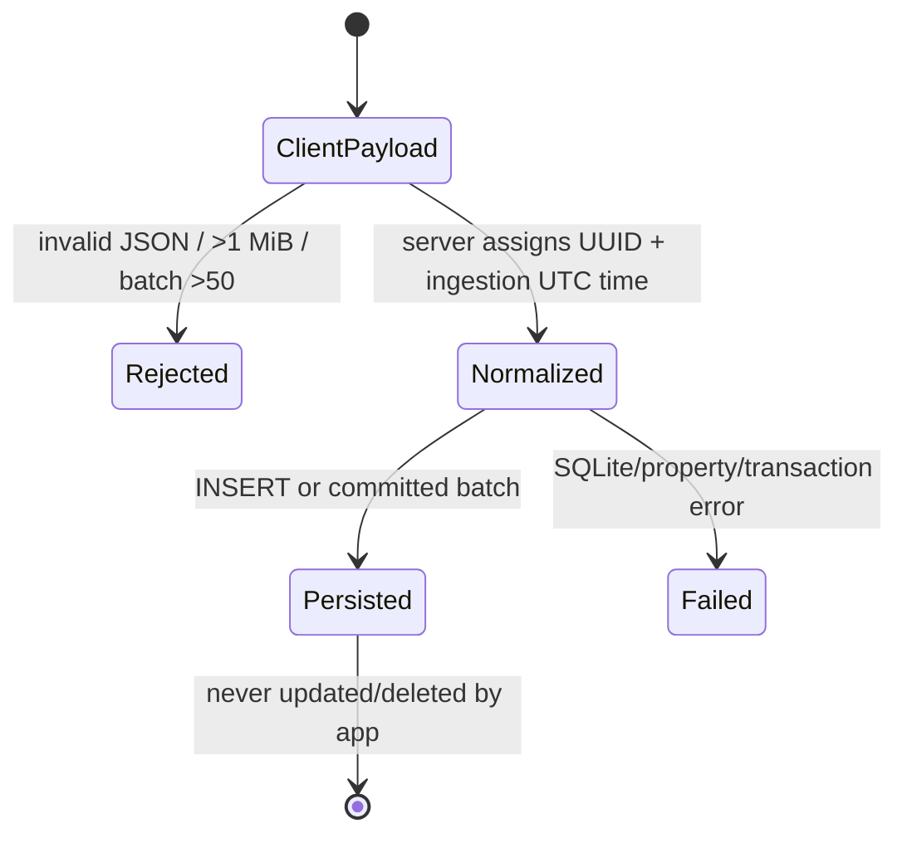
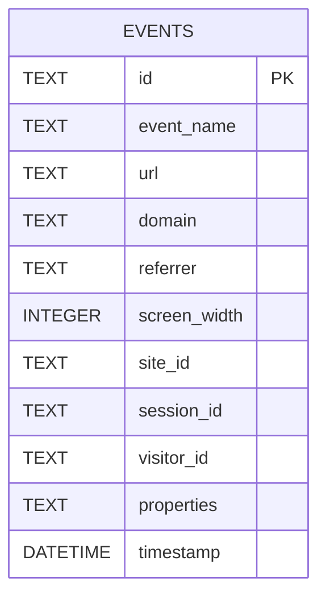

# 03 — Backend, Domain, Database, and API Contracts

> **Essential · Business semantics reference**

## Actual backend layers

```text
net/http ServeMux + CORS
        ↓
Handler (transport parsing + a small amount of business calculation)
        ↓
EventRepository interface
        ↓
SqliteRepository (persistence + most analytics/domain calculations)
        ↓
SQLite events table
```

This is not a conventional controller/service/repository three-layer backend. There is no service/use-case layer. The handler computes comparison periods/change percentages and validates only a few query/body conditions. The repository contains SQL plus P75, Web Vitals classification/scoring, referrer normalization, conversion semantics, and output sorting. `pkg/core` is DTOs/interfaces, not entities with invariants.

Dependency injection is constructor injection (`api.NewHandler(sqliteRepo)`) against one interface. Tests use the real SQLite repository; handlers are not mocked.

## Routing and middleware

`cmd/server/main.go:44-64` registers exact strings on Go 1.22 `ServeMux`, but patterns do not specify methods. Therefore:

- read handlers answer POST/other methods if invoked;
- ingestion handlers attempt to decode bodies on GET/PUT/etc.;
- only OPTIONS is intercepted by CORS;
- unsupported methods do not reliably return 405 or `Allow`.

Every API handler is wrapped independently in the same CORS function. There is no request-ID, logging, recovery, authentication, authorization, rate-limit, compression, security-header, timeout, or metrics middleware.

`http.ServeMux` recovers panics in connection goroutines and writes 500, but application-specific recovery/log correlation is absent. `writeJSON` ignores encode errors (`pkg/api/handler.go:23-27`).

## Domain glossary and rules

### Event

An immutable fact row representing one ingestion, not necessarily one real user action. Fields are documented in the schema below.

Lifecycle:



Properties are deep-copied while strings are truncated. Invalid JSON-marshalling values cannot originate from decoded JSON in normal HTTP input, but direct internal calls fall back to `{}` instead of returning an error.

### Site

`site_id` is a free string in each event. A SiteStat is derived by grouping:

`effective_site_id = COALESCE(NULLIF(site_id,''), domain)`

The `siteMatchClause` also matches either effective site ID **or raw domain**, preserving legacy domain lookups (`pkg/db/query.go:20,618-645`). There is no ownership, allowed-domain list, lifecycle, create/update/delete, or unique constraint. One forged event creates a dashboard “site.”

### Domain and URL

Caller-provided strings captured from browser location in the official SDK. The backend does not verify that URL, domain, request Origin, and site ID agree. Full query strings and fragments may be stored.

### Visitor

Distinct `visitor_id` among pageviews in a query window. Official SDK visitor ID rotates at UTC day boundary. Therefore:

- daily series gives per-day browser/profile identifiers;
- a multi-day aggregate counts the same browser once per day at minimum if active daily;
- “unique visitors” is not a person count and not stable across storage clearing/privacy contexts/devices.

### Session

Distinct `session_id` among pageviews. Official ID normally lives for a browser tab’s `sessionStorage` lifetime. It has no inactivity timeout, cross-tab merge, or server validation. Duplicating a tab retained the same session ID in the committed Chrome baseline, contradicting the simple “per tab” model.

### Pageview

Exactly an event whose name equals `$pageview`. No URL deduplication, bot exclusion, site validation, or occurrence-time semantics are applied.

### Custom event

Any non-empty name not beginning with `$`. Reserved `$click` is not included in custom-event reporting. There is no name length/character validation.

### Web Vital

An event named `$web_vital` whose JSON properties include `$name` and numeric `$val`. Supported reporting thresholds:

| Metric | Good ≤ | Needs improvement ≤ | Poor > |
|---|---:|---:|---:|
| LCP | 2500 ms | 4000 ms | 4000 |
| INP | 200 ms | 500 ms | 500 |
| CLS | 0.1 | 0.25 | 0.25 |

P75 uses nearest-rank `ceil(.75*n)-1` after sorting in memory. Overall score maps 0→100, good threshold→90, poor threshold→50, 2×poor→0, averages available metric scores, and sums all metric samples as `sample_size` (`pkg/db/query.go:662-748`).

### Device

Derived from pageview `screen_width`: `<768 Mobile`, `<1024 Tablet`, otherwise Desktop. Missing/zero/negative widths become Mobile. It is viewport classification, not hardware detection.

## Invariants and invalid-state risks

Enforced:

- database event `id` is non-null primary key when server supplies UUID;
- batch writes are atomic;
- request body is limited to 1 MiB;
- batch has at most 50 elements;
- query APIs generally require nonempty `site_id` or legacy `domain`;
- custom-event series rejects empty or `$`-prefixed names.

Not enforced:

- nonempty event/site/domain/URL/session/visitor;
- URL/domain/origin consistency;
- property depth/key count/total semantic size;
- valid Web Vital metric/range;
- screen width range;
- timestamp occurrence/order;
- registered/authorized site;
- event idempotency;
- referential integrity;
- retention or deletion.

Rules duplicated in Go/UI/docs include thresholds, event taxonomy, date formats, batch maximum (documented but not encoded in SDK config), and response types.

## Database architecture

### Technology and connection management

**Confirmed:** SQLite through `github.com/mattn/go-sqlite3 v1.14.33`; SQLite runtime version is whatever that driver/toolchain embeds at build time, not pinned separately. `database/sql` default pool settings are used: no `SetMaxOpenConns`, lifetime, or idle limit. No DSN PRAGMAs configure WAL, foreign keys, synchronous mode, or busy timeout.

The schema is created at application startup. There is no migration directory, version table, migration lock, seed script, or rollback. `CREATE TABLE IF NOT EXISTS` cannot evolve an existing table.

### Entity-relationship model



There is only one entity. Site, visitor, session, page, referrer, and metric relationships are implicit repeated strings—not foreign keys.

### `events` data dictionary

| Column | Meaning/writer/readers | Constraints and risks |
|---|---|---|
| `id TEXT` | server UUID; lab/raw reconciliation | Primary key only explicit constraint; no client event identity |
| `event_name TEXT` | SDK/manual caller; all metric filters | Nullable/unbounded; `$` convention only |
| `url TEXT` | full browser URL; pages/vitals | Nullable/unbounded; may contain PII/secrets |
| `domain TEXT` | browser hostname; legacy site matching/site list | Nullable/unverified |
| `referrer TEXT` | document referrer; referrer report | Nullable/unbounded; normalized in Go after loading rows |
| `screen_width INTEGER` | `window.innerWidth`; device report | Nullable/unbounded; invalid values classify |
| `site_id TEXT` | SDK config; all tenant filters | Nullable/unverified/no index combined with time/name |
| `session_id TEXT` | browser sessionStorage; stats/conversion | Nullable/unverified |
| `visitor_id TEXT` | daily browser ID; visitor/referrer/custom reports | Nullable/pseudonymous |
| `properties TEXT` | JSON-marshalled custom/vital/click data | No `json_valid` constraint; queries rely on SQLite JSON functions |
| `timestamp DATETIME` | server `time.Now().UTC()` | Ingestion time; nullable for direct repository writes |

Indexes:

- `idx_events_domain(domain)`
- `idx_events_site_id(site_id)`
- `idx_events_timestamp(timestamp)`

There are no compound indexes. Most queries filter event name + site expression + `datetime(timestamp)`. The `OR`, `COALESCE/NULLIF`, and datetime wrapping can reduce index effectiveness. Referrer, vital, and per-page calculations load many matching rows into Go. Query plans must be measured before changing indexes; roadmap explicitly calls for compound indexes and removal of index-blocking timestamp expressions.

### Reads/writes/deletes and transactions

- Only ingestion writes. There are no application updates/deletes.
- Single insert is one implicit SQLite transaction.
- Batch uses `BeginTx`, prepared INSERT, rollback-on-return, and commit.
- Queries are independent; performance score is not a consistent multi-query snapshot under concurrent writes.
- Default SQLite isolation/locking and database/sql pooling apply. No explicit read transaction.
- No soft deletion, audit table, retention, compaction, vacuum schedule, or data export.

### N+1 and scan risks

- Dashboard Sites view calls one trends endpoint per site.
- Overview calls 11 endpoints; performance score duplicates vital/distribution reads.
- Referrer query loads all matching `(referrer, visitor_id)` rows and deduplicates in Go.
- Vitals load and sort all samples in Go, repeated for distributions and score.
- Page performance performs two queries and groups/sorts in Go.
- A single event table grows without retention; analytical cost grows with it.

### Integrity, auditability, and sensitive data

The append-only application behavior aids forensic history, but there is no actor, client time, schema version, SDK version, or cryptographic/audit integrity. IDs and URLs are pseudonymous/potentially personal data. Custom properties and click text can explicitly contain PII. Backup encryption/access are external.

### Backup/restore assumptions

The production repo does not schedule backups. The lab proves a technique: SQLite `VACUUM INTO`, `integrity_check`, row reconciliation, boot a server from the copy, and query aggregates (`internal/reliability/faults.go → runBackupVerification`; `testing/load/README.md:190-192`). Treat this as validated test logic, not configured production automation.

### Schema evolution history

- Initial repository commit `66710fe` created `events` without site/visitor columns or indexes.
- Later dashboard/site work added `site_id`, `visitor_id`, and indexes through edited startup DDL rather than migrations.
- Batching commit `0b11462` added transactional multi-insert but no schema change.
- No historical migration files exist, so an old deployed DB’s exact upgrade path is **unknown**. `CREATE TABLE IF NOT EXISTS` would not add missing columns; this is a material legacy-deployment risk.

## API conventions

- Base: same Go origin, `/api`.
- Formats: ingestion consumes JSON; reads return JSON; errors are plain text.
- Auth: none.
- CORS: any Origin reflected with credentials, wildcard without Origin.
- Rate limits: none.
- Idempotency: none; repeated identical submissions create different UUID rows.
- Time filters: optional strings passed to SQLite. Date-only `to` expands to `23:59:59`; fractional last-second values can be excluded. Invalid time strings usually produce no matches rather than 400.
- Site compatibility: `site_id`, falling back to query `domain`.
- Methods shown below are intended from callers; backend does not enforce them.

## Complete API catalogue

Common read errors: missing site → 400 `site_id is required`; repository error → 500 `Query failed`. All successful reads are 200 JSON.

| Intended method/path | Purpose and caller | Request/response | DB behavior/side effects |
|---|---|---|---|
| POST `/api/event` | One SDK event | Body `EventPayload`; 202 empty; 400 invalid JSON; 413 may be produced by MaxBytesReader decode; 500 insert | Assign UUID/time, truncate props, one INSERT, log full identifiers |
| POST `/api/events` | Batched SDK events | JSON array; empty→202; >50→413; otherwise 202/400/500 | Same normalization timestamp for all; atomic transaction |
| GET `/api/stats` | Legacy/direct clients; API client defines but App uses trends | `{pageviews, unique_visitors, sessions}` | Counts `$pageview`, distinct IDs |
| GET `/api/site-trends` | Overview/Sites | `{current,previous,change}` | Current stats plus optional equal-duration previous stats; handler computes percent |
| GET `/api/pages` | Overview | `PageStat[]`, max 10 | Group `$pageview` by full URL |
| GET `/api/referrers` | Overview | `ReferrerStat[]`, max 10 | Loads pageview refs, strips `www`, lowercases host, distinct visitors in Go |
| GET `/api/vitals` | Vitals | `VitalStat[]` | Loads all `$web_vital` values; nearest-rank P75 per name |
| GET `/api/vitals/distribution` | Vitals | `VitalDistribution[]` | Classifies supported samples in Go |
| GET `/api/vitals/pages` | Vitals | `PagePerformanceStat[]`, max 20 | P75 per URL/metric + traffic query; worst severity/high traffic first |
| GET `/api/vitals/score` | Vitals | `PerformanceScore` | Calls vitals and distributions again; custom score formula |
| GET `/api/custom-events` | Events | summary + all event rows | Any non-`$` event; conversion; optional previous period trend in handler |
| GET `/api/custom-events/timeseries` | Selected event | requires non-`$` `event_name`; daily `{date,count}[]`; invalid→400 | Exact event-name group by UTC-ish SQLite date |
| GET `/api/devices` | Overview | `{device,count}[]` | Pageviews classified by width |
| GET `/api/timeseries` | Overview | daily `{date,pageviews}[]` | Pageview group by timestamp date |
| GET `/api/timeseries/visitors` | Overview | daily `{date,uniqueVisitors}[]` | Distinct visitor per day |
| GET `/api/timeseries/sessions` | Overview | daily `{date,sessions}[]` | Distinct session per day |
| GET `/api/sites` | Dashboard startup | `SiteStat[]`; no site required | Derives site/domain groups from all events |
| GET `/debug/pprof/*` | Lab profiling only | Go pprof formats | Enabled only with `IRIS_LAB_PPROF=1`; no auth |
| GET `/...` | Dashboard assets | static files from `DASHBOARD_DIR` | No DB |

### Wire shapes

Ingestion:

```json
{
  "n": "$pageview",
  "u": "https://example.com/pricing?campaign=x",
  "d": "example.com",
  "r": "https://search.example/",
  "w": 1440,
  "s": "site-a",
  "sid": "browser-generated-id",
  "vid": "daily-browser-generated-id",
  "p": {"optional": "value"}
}
```

Read query:

```text
?site_id=site-a&from=2026-07-01&to=2026-07-30
```

Timestamp alternatives accepted by handler previous-period parsing include RFC3339/RFC3339Nano and dates. SQLite itself receives raw strings and performs its own parsing.

### Contract weaknesses

- Go and TypeScript types are manually duplicated.
- No OpenAPI/JSON Schema/content negotiation/version prefix/runtime response validation.
- Ingestion’s `core.Event` accepts server fields `id`/`ts` in the JSON shape even though they are overwritten.
- JSON property map is untyped.
- Empty slices are inconsistently `null` or `[]` depending on query method initialization; UI defensively uses `?? []`.
- No cache headers/ETags.
- Date/timezone and event semantics are implicit and partially contradictory.
- There are no internal events, queues, webhooks, cron contracts, service calls, or file upload formats.

## Error, timeout, concurrency, and retry behavior

- Errors are strings rather than typed errors. Repository errors propagate; handlers map all DB read errors to 500.
- No handler validates request context deadlines because server has none; client abort can cancel DB calls.
- database/sql can run concurrent connections against SQLite, contributing to lock errors.
- No server retry/busy timeout/circuit breaker.
- No idempotency key or `INSERT OR IGNORE`.
- Server time assignment makes client-side replay indistinguishable and changes occurrence semantics.
- Process shutdown can terminate in-flight requests; batch transaction behavior depends on connection/process interruption.
- Single-event log line per accepted request can amplify I/O under load.
