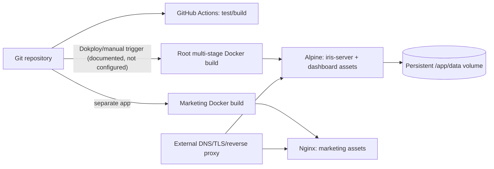

# 05 — Delivery, CI/CD, Operations, and Debugging

> **Operationally critical**

## Source-to-production path



Text explanation: CI verifies but does not publish or deploy. README recommends two Dokploy applications and watch paths. How Dokploy is connected, which registry stores images, domains, TLS, region, secret injection, health checks, and rollback policy are absent. The analytics artifact contains a statically linked-ish Go binary requiring Alpine/CGO-compatible SQLite plus dashboard assets. Marketing is independent static Nginx.

## Local development handbook

### Prerequisites

Repository-declared/documented minimums:

- Go 1.22 (`go.mod`);
- Node 20+ in README; CI actually uses Node 22; Docker uses Node 20;
- pnpm 10.28.2 in CI/root dependency;
- Task (optional convenience);
- a C compiler/CGO toolchain for `go-sqlite3`;
- Docker for container/k6 flows;
- Chromium/Chrome for browser oracle.

Exact supported OS/package-manager versions are unknown.

### Clean setup

```bash
git clone https://github.com/VatsalP117/iris.git
cd iris
go mod download
pnpm install --frozen-lockfile
```

Do not copy a real production `.env` into shared logs. The app needs no secrets locally.

Start in two terminals:

```bash
task dev:backend
task dev:dashboard
```

Open `http://localhost:5173`. Because no seed exists, the dashboard initially shows no sites. Generate disposable data:

```bash
curl -i http://localhost:8080/api/event \
  -H 'Content-Type: application/json' \
  --data '{"n":"$pageview","u":"http://example.test/","d":"example.test","r":"","w":1440,"s":"local-demo","sid":"session-1","vid":"visitor-1"}'
```

Expected: `202 Accepted`; dashboard site `local-demo` after refresh. The Task backend DB is `cmd/server/data/iris.db`, not root `data/iris.db`, because of its cwd.

Inspect:

```bash
sqlite3 cmd/server/data/iris.db '.schema'
sqlite3 cmd/server/data/iris.db 'select event_name, site_id, timestamp from events order by timestamp desc limit 5;'
```

Build/test:

```bash
go test -race ./...
go vet ./...
pnpm test:browser-oracle
pnpm --filter iris-analytics build
pnpm --filter @iris/dashboard build
pnpm --filter marketing lint
pnpm --filter marketing build
```

Quick reliability checks (disposable, resource-intensive):

```bash
IRIS_LAB_QUICK=true task lab:suite
IRIS_LAB_QUICK=true task lab:faults
pnpm lab:browser -- --allow-failures
```

### Reset

Stop processes. Move the exact disposable DB to a backup name or trash; do not delete a broad directory:

```bash
mv cmd/server/data/iris.db cmd/server/data/iris.db.backup
```

Restarting recreates the current schema. There is no seed/migration reset command.

### Common local failures

- Dashboard has no sites: no event rows or wrong backend DB/cwd.
- Dashboard API 404 from Vite: backend not on 8080 or proxy config changed.
- Dashboard static 404 from Go: default `DASHBOARD_DIR` is relative to backend cwd; build and set the correct path.
- SQLite open failure with custom DB path: create its parent; server only creates literal relative `data`.
- CGO build failure: install compiler/toolchain; `CGO_ENABLED=1`.
- Browser oracle cannot find browser: install Playwright Chromium or set `IRIS_BROWSER_EXECUTABLE`.
- Marketing `/docs` works through client navigation but not direct request: configure SPA fallback at hosting layer.

## Container build/run

```bash
docker build -t iris-local .
docker run --rm -p 8080:8080 -v "$PWD/data:/app/data" iris-local
```

This command is a local template, not a production recommendation. Ensure the chosen directory is disposable/secured and confirm permissions.

Compose evidence:

```bash
docker compose up -d
docker compose logs -f iris
docker compose down
```

Host port is 8081. The bind mount is `../files/iris-data`, so confirm that exact host location before starting. Compose restart policy is `unless-stopped`.

## Image details

Root image:

1. Node 20 Alpine installs global pnpm without a pinned global install command version, although lockfile/package constrain dependencies.
2. Isolated dashboard workspace is installed/frozen and built.
3. Go 1.24 Alpine downloads modules; GCC/musl support CGO; binary uses stripped flags.
4. Latest Alpine runtime installs CA certs/tzdata, copies binary/assets, declares volume/port, and starts binary.

Risks: base tags (`alpine:latest`, language major/minor tags) are mutable, no digest/SBOM/signing/non-root/healthcheck, Go build version differs from `go.mod` minimum and CI toolchain, and image build does not run tests.

Marketing image uses Node 20 Alpine + `npm ci`, then `nginx:1.27-alpine`. It uses a separate lockfile and no custom Nginx config/healthcheck/non-root user.

## Deployment and rollback

**Confirmed commands:** only image builds/Compose and README’s Dokploy configuration. **Unknown:** production commands, registry, project IDs, domains, region, promotion, replicas, volume provider, maintenance window, and actual deployment trigger.

Safe generic sequence (templates requiring environment confirmation):

1. Run CI-equivalent checks.
2. Back up and integrity-check SQLite before any schema-affecting release.
3. Build immutable image tagged with commit SHA.
4. Deploy one instance attached to the existing persistent volume.
5. Verify logs, static root, a read endpoint for a known authorized test site (authorization currently absent), and a disposable ingestion canary.
6. Observe lock/error/latency/storage signals.

Rollback template:

1. Determine whether the release changed schema/data semantics. Current app has no formal migrations, so never assume old binary compatibility.
2. Redeploy the previous immutable image.
3. Keep the volume unless a proven incompatible data migration occurred.
4. If restoring data is necessary, stop writers, preserve the failed DB, restore a verified backup to a new file, run `PRAGMA integrity_check`, boot, compare counts/queries, then switch.

No zero-downtime guarantee exists. Multiple replicas sharing one local SQLite volume are not a supported topology. A process replacement can drop in-flight requests because no graceful shutdown.

## Database backup/restore runbook

No production script exists. The lab validates `VACUUM INTO`; confirm SQLite version, disk capacity, file ownership, and write traffic.

Backup template on the database host:

```sql
VACUUM INTO '/confirmed/backup/path/iris-backup.db';
```

Then:

```bash
sqlite3 /confirmed/backup/path/iris-backup.db 'PRAGMA integrity_check;'
sqlite3 /confirmed/backup/path/iris-backup.db 'select count(*) from events;'
```

Restore:

1. Stop Iris or otherwise guarantee no writers.
2. Preserve current DB under a timestamped name.
3. Copy the verified backup to a new target path with correct owner/mode.
4. Start Iris pointed at the restored file.
5. Check startup logs, `/api/sites`, representative aggregates, and row count.
6. Retain both files until validated.

Retention, off-host copies, encryption, RPO/RTO, scheduled testing, and provider snapshots are **unknown and must be defined**.

## CI/CD workflow

Triggers: every PR, push to `main`, and manual dispatch. Concurrency groups by PR/ref and cancels older runs. Workflow permissions are `contents: read`.

| Job | Checks | Artifacts/failure |
|---|---|---|
| `go_checks` | Go setup from mod, download, `go test -race ./...`, vet, build server/lab | No artifact upload; fails on any command |
| `javascript_checks` | frozen pnpm, comparator tests, SDK/dashboard builds, marketing lint/build | No artifact upload |
| `reliability_quick` | build server/lab; all quick profiles and faults | Captures both exit codes; uploads reliability directory for 14 days even on failure |
| `browser_regression` | frozen install, Chromium, browser oracle with known failures allowed, compare committed baseline | Comparator fails regressions/coverage/contract drift; uploads 14-day report |
| `ci_required` | requires all four job results exactly `success` | Stable branch-protection aggregation check |

Strengths:

- minimal workflow permissions;
- race detector/vet/builds;
- correctness/fault/browser regression gates;
- concurrency cancellation and timeouts;
- failure artifacts and stable aggregate gate.

Gaps:

- no deployment, image build, vulnerability/license/secret scan, SBOM, container scan, migration validation, accessibility test, dashboard unit/component test, or SDK TS unit test;
- action tags and external image tags are not pinned by digest/SHA;
- branch protection itself cannot be verified from repo;
- full-duration capacity/soak profiles are not CI gates;
- known browser failures are accepted unless they worsen;
- no artifact of normal builds;
- no rollback/promotion/environment controls;
- workflow currently relies on future-dated major action tags available at snapshot; upgrade behavior should be monitored.

## Error handling and resilience

### Current behavior

- Startup is fail-fast via `log.Fatal`.
- Request decode/DB errors are logged with handler labels; clients receive generic plain text.
- Accepted ingestion logs every request/event batch; reads log only errors.
- Batch transaction rolls back on one insert failure.
- Client catches fetch promise rejection only for debug logging and never requeues.
- Dashboard logs errors to console and often preserves stale data.
- No retry, timeout (server), circuit breaker, fallback storage, dedupe, or graceful degradation.

### Failure matrix

| Failure | Observed behavior | Corruption/loss risk |
|---|---|---|
| Invalid JSON / too large | 400 (MaxBytesReader error is also treated as invalid JSON) | No insert |
| Batch >50 | 413 | Client has discarded batch |
| SQLite locked/full | 500 | Request rejected; SDK does not retry |
| DB unavailable at startup | process exits | No service |
| DB fails during reads | 500 | No write corruption, dashboard stale |
| Server restart | in-flight connections break | Ambiguous/lost events; lab measures recovery |
| Network/offline/5xx | Beacon/fetch best effort | Confirmed loss |
| Response lost after commit | caller cannot know acceptance | Confirmed duplicate risk on retry/browser behavior |
| One batch row fails | rollback entire transaction | Atomic but all events lost at client |
| Dashboard endpoint fails | `Promise.all` rejects | Old/partial visual state, console only |
| Marketing deep route | likely stock Nginx 404 | Docs unavailable on refresh |

## Observability

Present:

- standard timestamped unstructured Go logs;
- handler labels and event/site/domain/URL for ingestion;
- optional pprof in lab mode;
- lab-generated CPU/RSS/I/O/DB/WAL/latency/correctness reports;
- no explicit health endpoint; lab treats `/api/sites` as health (`suite.go → waitForServer`).

Absent:

- log levels/JSON/correlation/request IDs;
- metrics endpoint/counters;
- distributed traces;
- production dashboards/alerts/error tracker/audit log;
- liveness/readiness/startup probes;
- version/build info endpoint;
- DB pool/lock/storage gauges.

What is currently impossible to diagnose reliably from production evidence alone:

- which browser event was lost and why;
- whether a 202 response reached the browser;
- end-to-end request correlation;
- per-site rejection/error/latency rates without parsing logs;
- exact deploy/version at runtime;
- readiness vs static/API partial health;
- long-term capacity trend;
- unauthorized read access/audit history.

## Incident debugging playbooks

### Users cannot “log in”

Iris has no login. If the report means dashboard access, inspect the external proxy/VPN/SSO layer (unknown to repo), then static asset delivery and APIs. Do not search for application users.

### API returns errors

1. Record method/path/status/time and whether all endpoints or writes only fail.
2. Inspect server log handler label/error.
3. Verify process and DB path/volume.
4. Run `sqlite3 <confirmed-db> 'PRAGMA integrity_check;'` read-only.
5. Check disk free, permissions, lock contention, and request/batch size.
6. Reproduce against a disposable site. Do not run reliability load on production.

### Requests are slow

1. Separate ingestion vs read endpoint and single vs batch.
2. Inspect CPU/RSS/disk/log throughput and DB size.
3. Look for `database is locked`.
4. Use a copied DB to run `EXPLAIN QUERY PLAN` for the exact query.
5. Reproduce with Lab mixed profile and pprof, preserving revision/environment.
6. Compare against compatible baseline; do not treat the M4 baseline as a production SLO.

### Database unavailable/incorrect data

Confirm effective `DB_PATH`, mount, file timestamp/size/owner, and whether a fresh empty DB was accidentally created. Run integrity/count/site/date checks read-only. For wrong analytics, trace event taxonomy, daily visitor/session semantics, site/domain fallback, timezone, and server ingestion timestamp before editing data.

### Deployment failed

Identify build vs startup vs proxy vs static failure. Check CGO architecture, bind port, DB parent/permissions, dashboard files, and logs. Roll back immutable image; preserve DB. There is no migration runner to undo.

### External provider down

No app API provider exists. Hosting/DNS/TLS/npm/Google Fonts are external operational dependencies. Analytics functionality can continue if Google Fonts fails; visual fonts fall back. Hosting/DNS failure requires provider procedures not in repo.

### Background job stuck/cache clearing

There are no background jobs or caches. A “stuck” symptom is a request/process/DB issue. Do not invent a queue restart or cache clear.

### Frontend works locally, not production

Check same-origin `/api`, proxy routing, dashboard directory, hashed asset 404s, base paths, and marketing SPA fallback. Local Vite proxy can hide production reverse-proxy mistakes.

### Missing configuration

Log effective non-secret paths/port; compare container env. Defaults can create unintended local DBs. CORS allowlist variables in `.env` are unused and will not secure anything.

## Routine operations

- **Restart:** use the platform/container restart, then verify process/API/DB. Exact production command unknown.
- **Secret rotation:** no application secrets exist. Rotate proxy/TLS/registry credentials per provider; after adding auth, document dual-key/expiry behavior.
- **Dependency upgrade:** update manifest+authoritative lock, read changelogs, run full CI/quick lab, build images, compare SDK browser baseline; major Go SQLite changes need restore/load testing.
- **Data correction:** no supported API. Preserve backup, define exact SQL with owner/reviewer, test on a copy, transactionally execute during controlled downtime, reconcile aggregates. Never silently edit production.
- **User support:** obtain site ID, time range/timezone, event name/URL, browser/network evidence; query APIs/DB without exposing other sites; current lack of audit/auth must be acknowledged.
- **Provider outage:** protect DB, avoid repeated destructive restarts, communicate ingestion loss possibility, and reconcile only accepted events where evidence exists.
