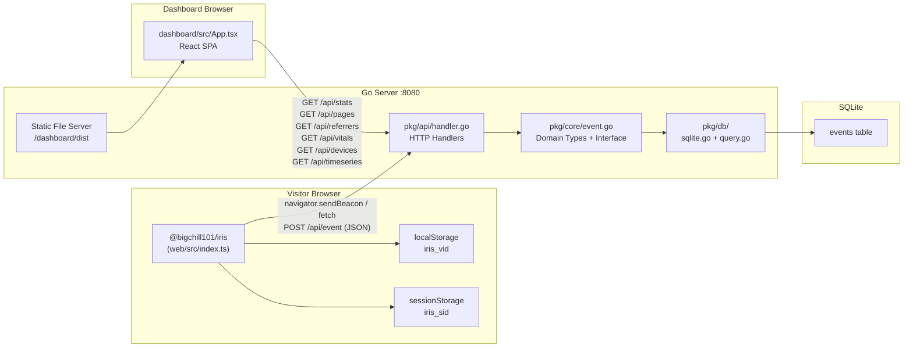

# Iris Analytics — Complete Architecture Summary

## Overview

Iris is a **self-hosted, privacy-first web analytics** system. It is made up of three independent but tightly coupled layers:

| Layer | Location | Tech | Role |
|---|---|---|---|
| **Client SDK** | `web/` | TypeScript (npm pkg) | Runs in visitor browsers, tracks events |
| **Backend Server** | `cmd/` + `pkg/` | Go + SQLite | Ingests events, answers queries |
| **Dashboard UI** | `dashboard/` | React + Vite | Visualises analytics data |

The entire system is packaged as a **single Docker container**. The Go binary serves both the API and the Dashboard's static files on a single port.

---

## System Architecture & Data Flow



---

## Layer 1: Client SDK (`web/`)

**Package name:** `@bigchill101/iris` (v0.0.4)  
**Build:** `tsup` → outputs ESM + CJS + `.d.ts` to `web/dist/`

### Files

#### [config.ts](file:///Users/vatsalpatel/Desktop/iris/web/src/config.ts)
Defines the two public types:
- **`IrisConfig`** — what the user passes into `new Iris({...})`:
  - `host` (required): URL of your Iris backend
  - `siteId` (required): logical site identifier
  - `autocapture` (default `true`): auto-click tracking toggle
  - `debug` (default `false`): console logging toggle
- **`EventPayload`** — the JSON shape sent to `/api/event` (short keys to minimise wire size)

#### [storage.ts](file:///Users/vatsalpatel/Desktop/iris/web/src/storage.ts)
Identity layer — **fully anonymous**, no cookies.
- **Visitor ID (`iris_vid`)** → `localStorage` — persists across sessions on same browser/device
- **Session ID (`iris_sid`)** → `sessionStorage` — unique per browser tab/session, cleared on tab close
- Falls back to a UUID v4 polyfill for old environments

#### [transport.ts](file:///Users/vatsalpatel/Desktop/iris/web/src/transport.ts)
Sends the `EventPayload` to `{host}/api/event`:
1. Prefers `navigator.sendBeacon` (fire-and-forget, survives page unloads)
2. Falls back to `fetch` with `keepalive: true`
> String payload is wrapped as `Blob` for sendBeacon, since it needs a specific content-type

#### [autocapture.ts](file:///Users/vatsalpatel/Desktop/iris/web/src/autocapture.ts)
Captures `$click` events automatically. Listens on `window` with `capture: true` (catches events before they bubble). Targets: `button`, `a`, `input[type=submit]`, `[role=button]`. Respects:
- `.iris-ignore` class → skip element
- `input[type=password]` → never captured (privacy)

Recorded properties per click: `$tag`, `$id`, `$class`, `$text` (first 50 chars), `$href` (links only).

> ⚠️ Marked as **WIP** — the comment says the team is still brainstorming the best approach.

#### [vitals.ts](file:///Users/vatsalpatel/Desktop/iris/web/src/vitals.ts)
Hooks into the `web-vitals` library to emit `$web_vital` events for:
- **LCP** (Largest Contentful Paint)
- **INP** (Interaction to Next Paint)
- **CLS** (Cumulative Layout Shift)

Each `$web_vital` event stores: `$id`, `$name`, `$val`, `$rating`.

#### [index.ts](file:///Users/vatsalpatel/Desktop/iris/web/src/index.ts)
The **main `Iris` class** — the public API surface.

| Method | What it does |
|---|---|
| `constructor(config)` | Merges defaults, creates `Transport` |
| `start()` | Fires initial `$pageview`, patches `history.pushState` for SPA routing, enables autocapture & vitals |
| `track(name, props?)` | Builds `EventPayload` from current `window` state and sends it |
| `stop()` | Removes `popstate` listener (cleanup for Next.js HMR) |

**SPA routing detection:** patches `history.pushState` to call `trackPageview()` and also listens to `popstate` (back/forward).

---

## Layer 2: Backend Server (`cmd/` + `pkg/`)

**Language:** Go 1.22  
**Dependencies:** `go-sqlite3` (CGO), `google/uuid`  
**Entry point:** `cmd/server/main.go`

### Package Structure

```
pkg/
├── core/       Domain types + repository interface (no deps)
├── api/        HTTP handlers (depends on core)
└── db/         SQLite implementation (depends on core)
```

This follows a clean **dependency inversion / ports-and-adapters** pattern. `core` defines the `EventRepository` interface; `db` implements it; `api` only talks to the interface — meaning the DB backend can be swapped without touching handlers.

### Files

#### [pkg/core/event.go](file:///Users/vatsalpatel/Desktop/iris/pkg/core/event.go)
The pure domain layer — **no external imports** except `context` and `time`.

**`Event` struct** — the canonical event record (JSON tags mirror the compact SDK payload keys):
```
id, event_name, url, domain, referrer, screen_width, site_id, session_id, visitor_id, properties (JSON), timestamp
```

**Result types:** `StatsResult`, `PageStat`, `ReferrerStat`, `VitalStat`, `DeviceStat`, `TimeSeriesBucket`

**`EventRepository` interface** — the contract the db layer must satisfy:
```go
Insert, GetStats, GetTopPages, GetTopReferrers, GetVitals, GetDevices, GetPageviewsTimeSeries, Close
```

#### [pkg/db/sqlite.go](file:///Users/vatsalpatel/Desktop/iris/pkg/db/sqlite.go)
Initialises SQLite and creates the schema on startup (idempotent `CREATE TABLE IF NOT EXISTS`).

**Schema:**
```sql
events (
  id TEXT PRIMARY KEY,
  event_name TEXT,
  url TEXT,
  domain TEXT,
  referrer TEXT,
  screen_width INTEGER,
  site_id TEXT,
  session_id TEXT,
  visitor_id TEXT,
  properties TEXT,   -- JSON blob
  timestamp DATETIME
)
```
**Indexes:** `domain`, `site_id`, `timestamp` — the three most common filter axes.

`properties` is stored as a serialised JSON string. SQLite's `json_extract()` is used at query time to pull values out (see vitals query).

#### [pkg/db/query.go](file:///Users/vatsalpatel/Desktop/iris/pkg/db/query.go)
All read queries. Each follows the same pattern:
- Required filter: `domain = ?`
- Optional date range: `(? = '' OR timestamp >= ?)` — passing an empty string skips the filter

| Method | SQL logic |
|---|---|
| `GetStats` | `COUNT(*)` pageviews + `COUNT(DISTINCT visitor_id/session_id)` — only `$pageview` events |
| `GetTopPages` | Group by `url`, order by count DESC, limit 10 |
| `GetTopReferrers` | Group by `referrer`, count distinct visitors, exclude empty referrer |
| `GetVitals` | `json_extract(properties, '$.$name')` + `AVG($.$val)` on `$web_vital` events |
| `GetDevices` | CASE on `screen_width`: `<768` Mobile, `<1024` Tablet, else Desktop |
| `GetPageviewsTimeSeries` | `strftime('%Y-%m-%d', timestamp)` group by day, order ASC |

#### [pkg/api/handler.go](file:///Users/vatsalpatel/Desktop/iris/pkg/api/handler.go)
HTTP layer wiring `net/http` to the repository.

**CORS:** All endpoints call `setCORSHeaders()` — sets `Access-Control-Allow-Origin` to the request's `Origin` header (or `*` if absent), allowing `GET, POST, OPTIONS`.

**String truncation:** `truncateStrings()` recursively walks the `Properties` map and truncates any string value > 200 chars to prevent abuse/bloat.

**`POST /api/event` (TrackEvent):**
1. Decode JSON body into `core.Event`
2. Assign server-generated `ID` (UUID) and `Timestamp` (UTC)
3. Truncate long property strings
4. Call `repo.Insert()`

**Read endpoints** (all `GET`, all require `?domain=`):
```
/api/stats       → GetStats
/api/pages       → GetTopPages
/api/referrers   → GetTopReferrers
/api/vitals      → GetVitals
/api/devices     → GetDevices
/api/timeseries  → GetPageviewsTimeSeries
```

#### [cmd/server/main.go](file:///Users/vatsalpatel/Desktop/iris/cmd/server/main.go)
Bootstraps everything:
1. Reads `PORT` (default `8080`) and `DB_PATH` (default `./data/iris.db`) from env
2. Creates `data/` directory if missing
3. Opens `SqliteRepository`
4. Registers all HTTP routes
5. Serves `dashboard/dist` as static files on `/` (catches all unmatched routes)
6. Starts `http.ListenAndServe`

---

## Layer 3: Dashboard UI (`dashboard/`)

**Framework:** React 18 + Vite + TypeScript  
**Key deps:** `recharts` (charts), `date-fns` (date math)

### State management
All state lives in a single `App.tsx` component — no global store. `useCallback` + `useEffect` trigger `fetchAll()` whenever `domain` or the date range changes. All 6 API calls are parallelised with `Promise.all`.

### Files

#### [dashboard/src/api.ts](file:///Users/vatsalpatel/Desktop/iris/dashboard/src/api.ts)
Thin API client. `BASE = ""` means all requests go to the same host as the dashboard (the Go server serves both). `buildParams` constructs the `?domain=&from=&to=` querystring.

#### [dashboard/src/App.tsx](file:///Users/vatsalpatel/Desktop/iris/dashboard/src/App.tsx)
The root component — handles all state. Contains:
- **Sidebar** with tab navigation (Overview / Pages / Referrers / Web Vitals / Devices)
- **Topbar** with domain input form + date preset buttons (7d / 30d / 90d)
- **Content area** — switches between tab views, always shows `StatsCards` at top

#### Components

| File | What it renders |
|---|---|
| [StatsCards.tsx](file:///Users/vatsalpatel/Desktop/iris/dashboard/src/components/StatsCards.tsx) | 3 top-level KPI cards: Pageviews, Unique Visitors, Sessions |
| [PageviewsChart.tsx](file:///Users/vatsalpatel/Desktop/iris/dashboard/src/components/PageviewsChart.tsx) | Recharts `LineChart` with zero-filled date buckets for the full window |
| [TopPages.tsx](file:///Users/vatsalpatel/Desktop/iris/dashboard/src/components/TopPages.tsx) | Table with relative URL paths + proportional bar chart per row |
| [TopReferrers.tsx](file:///Users/vatsalpatel/Desktop/iris/dashboard/src/components/TopReferrers.tsx) | Same style table, `cleanReferrer()` strips `https://www.` prefix |
| [WebVitals.tsx](file:///Users/vatsalpatel/Desktop/iris/dashboard/src/components/WebVitals.tsx) | LCP / INP / CLS cards with colour-coded ratings (thresholds from web.dev/vitals) |
| [DeviceBreakdown.tsx](file:///Users/vatsalpatel/Desktop/iris/dashboard/src/components/DeviceBreakdown.tsx) | Mobile / Tablet / Desktop with percentage bars |

---

## Infrastructure

### Docker (multi-stage build)
```
Stage 1 (node:20-alpine):  pnpm build → dashboard/dist/
Stage 2 (golang:1.24-alpine): CGO_ENABLED=1, gcc → iris-server binary
Stage 3 (alpine:latest):   copies binary + dashboard/dist, VOLUME /app/data
```
SQLite db is persisted via a Docker volume at `/app/data/iris.db`.

### docker-compose.yml
Runs on `host:8081 → container:8080`. Mounts `./data:/app/data` for SQLite persistence.

### pnpm workspaces
`pnpm-workspace.yaml` ties together `web/` and `dashboard/` packages in a monorepo. `Taskfile.yml` provides dev shortcuts (likely `task dev`, `task build`, etc.).

---

## Event Taxonomy

| Event name | Fired by | When |
|---|---|---|
| `$pageview` | `Iris.start()`, `history.pushState`, `popstate` | Every page navigation |
| `$click` | `autocapture.ts` | Click on buttons/links (when autocapture enabled) |
| `$web_vital` | `vitals.ts` via `web-vitals` lib | CLS / INP / LCP reported by browser |
| Custom events | `iris.track("my_event", props)` | Manually called by developer |

---

## Key Design Decisions & Known Limitations

> [!NOTE]
> These are important to understand before making changes.

1. **No authentication on the API** — anyone who knows your server URL can query analytics for any domain. The API is designed for trusted internal/selfhosted use.

2. **Domain is the only multi-tenancy axis** — `site_id` is stored but all current queries filter by `domain`. `site_id` is essentially unused on the read path.

3. **`history.pushState` patch is not cleaned up** — `stop()` only removes the `popstate` listener. The `pushState` monkey-patch persists after `stop()` (intentional — noted in comment, due to other libraries also patching it).

4. **Autocapture is WIP** — the `autocapture.ts` comment explicitly flags this as "work in progress, still brainstorming".

5. **No batching / queue in transport** — every single event fires an immediate HTTP request. High-frequency click events could cause many requests.

6. **SQLite + CGO** — requires `gcc` at build time and is single-file, single-process. Not horizontally scalable, but appropriate for self-hosted / personal use.

7. **Device detection via screen width** — not User-Agent parsing. Breakpoints: `<768px` = Mobile, `<1024px` = Tablet, `≥1024px` = Desktop.

8. **Properties are stored as a flat JSON string** — queried via SQLite's `json_extract()`. Works for simple cases (vitals), but complex property querying is limited.

9. **No pagination** on `/api/pages` and `/api/referrers` — hard-coded `limit 10`.

---

## Extension Points

| What you want to add | Where to touch |
|---|---|
| New event type / property | `web/src/` (emit), `pkg/core/event.go` (type), `pkg/db/query.go` (query), `pkg/api/handler.go` (endpoint), `dashboard/src/` (visualise) |
| New analytics query | Add method to `EventRepository` interface in `core/event.go`, implement in `db/query.go`, add handler in `api/handler.go`, add fetch in `dashboard/src/api.ts` |
| Swap SQLite for another DB | Write a new struct implementing `core.EventRepository` — handlers don't need changes |
| Auth / API key protection | Add middleware in `cmd/server/main.go` before registering routes |
| Batching / queue | Modify `web/src/transport.ts` — buffer events and flush periodically |
