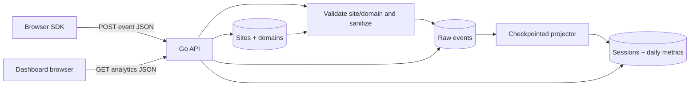

# Iris Analytics — Architecture Summary

This is the concise system map. The detailed, authoritative data contract is
[docs/09_V2_DATA_ARCHITECTURE.md](docs/09_V2_DATA_ARCHITECTURE.md), and the
broader evidence handbook begins at
[docs/PROJECT_HANDBOOK.md](docs/PROJECT_HANDBOOK.md).

## System shape

Iris is a self-hosted modular monolith with four repository workspaces:

| Layer | Location | Technology | Responsibility |
|---|---|---|---|
| Browser SDK | `web/` | TypeScript | Identity, capture, payload construction, delivery |
| Server | `cmd/server`, `pkg/` | Go `net/http` | Validation, persistence, queries, maintenance |
| Dashboard | `dashboard/` | React 18 + Vite | Site/date selection and analytics presentation |
| Marketing | `marketing/` | React 19 + Nginx | Separately deployed public site and docs |

The server and dashboard ship together. SQLite is an embedded file on a
persistent volume; there is no database network service, queue, or separate
worker process.

```mermaid
flowchart LR
    SDK["Browser SDK"] -->|"POST event JSON"| API["Go API"]
    OP["Dashboard browser"] -->|"GET analytics JSON"| API
    API --> VALIDATE["Validate site/domain and sanitize"]
    VALIDATE --> RAW[("Raw events")]
    RAW --> PROJECTOR["Checkpointed projector"]
    PROJECTOR --> DERIVED[("Sessions + daily metrics")]
    CONTROL[("Sites + domains")] --> VALIDATE
    API --> CONTROL
    API --> RAW
    API --> DERIVED
```

## Browser identity and delivery

- Visitor IDs live in per-site `localStorage` keys and rotate at midnight in the configured site timezone.
- Session IDs also live in `localStorage`, are shared by same-origin tabs, and
  roll after 30 minutes without tracked activity.
- Storage failures fall back to memory for the page lifecycle.
- Every event gets a client-generated idempotency ID, occurrence timestamp,
  wire version, and SDK version.
- Delivery is Beacon-first with fetch fallback and optional in-memory batching.
  The queue is not durable and does not retry rejected delivery.
- Autocapture is opt-in and can cover pageviews, clicks, and Web Vitals.

## Ingestion contract

Before tracking, register the site and its allowed hostnames through
`POST /api/sites`. This mutation requires
`Authorization: Bearer <IRIS_ADMIN_TOKEN>` and is disabled when the environment
variable is unset. Site listing, analytics reads, and event ingestion remain
unauthenticated.

For each event the server:

1. validates required IDs, name, width, timestamp skew, wire version, site, and
   allowed hostname;
2. accepts only absolute HTTP(S) tracked/referrer URLs without user information;
3. removes query strings and fragments and extracts typed path/referrer fields;
4. records client occurrence time and server receive time separately;
5. inserts by unique client ID, making replay idempotent;
6. returns `202 Accepted` only after the raw transaction commits.

## SQLite architecture

Connections use foreign keys, WAL, a five-second busy timeout, and `NORMAL`
synchronous mode. One connection serializes ingestion, site changes,
projections, and retention. A separate pool permits up to four read connections.

Versioned embedded SQL migrations are recorded in `schema_migrations`. The first
v2 migration upgrades a legacy events-only database transactionally.

Tables are grouped by responsibility:

- control plane: `sites`, `site_domains`, and reserved `ingest_keys`;
- source of truth: append-only-within-retention `events`, ordered by `seq`;
- rebuildable state: `sessions`, `daily_site_metrics`, `daily_page_metrics`, and
  exact daily referrer/visitor/session sets;
- operational state: `schema_migrations` and `projection_checkpoints`.

Compound event indexes start with site and occurrence time, with event-name,
session, and visitor variants. Common URL dimensions are typed columns;
arbitrary event properties remain validated JSON text.

## Projection and retention lifecycle

The in-process maintenance loop drains up to 1,000 events per projection batch
at startup and polls every 250 ms. Derived writes and checkpoint movement commit
together. A version mismatch fails closed. `iris-server rebuild-projections`
clears only derived state and deterministically replays the raw log.

Retention runs at startup and every 24 hours using each site's `retention_days`.
`iris-server apply-retention` also runs it explicitly. Expired raw facts,
sessions, and daily rows are removed in one serialized transaction.

`GET /api/status` and `/healthz` report database health and projection progress.
Backups, WAL/file-size maintenance, and external observability remain operator
responsibilities.

## Scaling boundary

SQLite is intentional for a single-node, self-hosted deployment. Consider
PostgreSQL for a multi-user control plane and ClickHouse for analytical facts
only after measurements show sustained writer saturation, multi-replica ingest,
unbounded projection lag, or unacceptable ad-hoc/raw-query latency at very large
event volumes. The raw-fact and rebuildable-projection boundary keeps that future
move independent of the browser contract.
